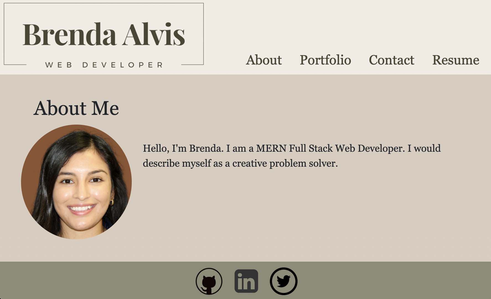

# My React Portfolio

<h2 align="center"> My React Portfolio</h2>

  <a href="#About">About</a> •
  <a href="#how-to-use">How To Use</a> •
  <a href="#credits">Credits</a> •
  <a href="#license">License</a>

## About

This is my professional portfolio to display my skills, past work, and contact information. This application was built using React and javascript. 

## How To Use

- [Deployed Portfolio](https://bralvis2.github.io/my-react-portfolio)
 
To access my portfolio, you can click on the link above and naviate the site using the navigation bar. 

## Credits

I used materials from class as a resource.

This software uses the following open source packages:

- [React](https://reactjs.org/)
- Emojis are taken from [here](https://github.com/arvida/emoji-cheat-sheet.com) 

## License

MIT

---

> GitHub [@bralvis2](https://github.com/bralvis2) &nbsp;&middot;&nbsp;

